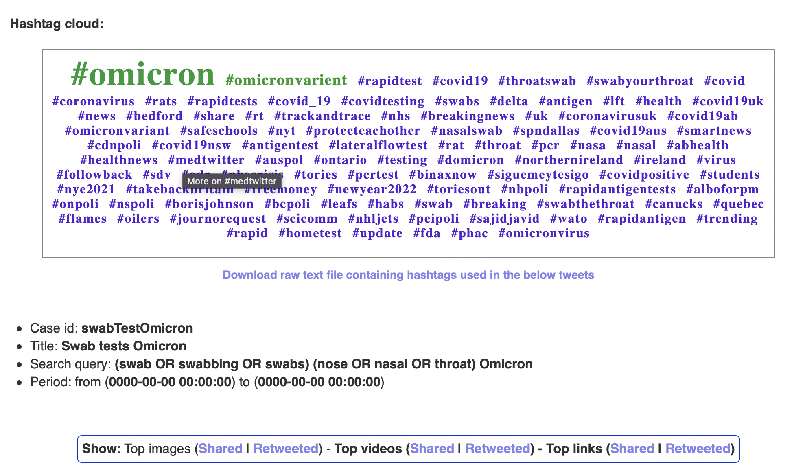
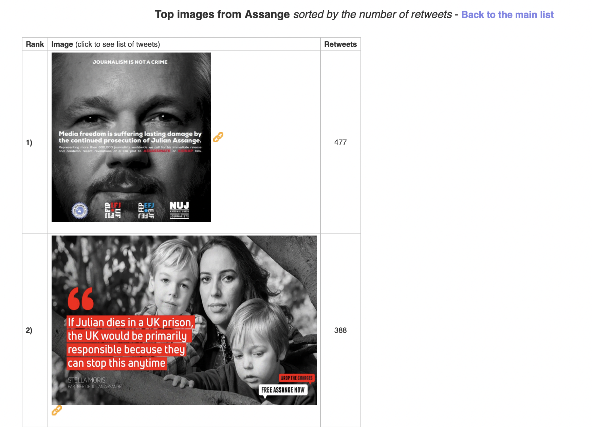
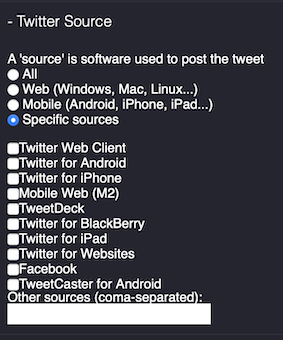
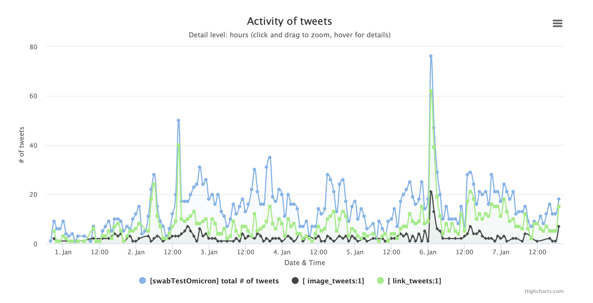
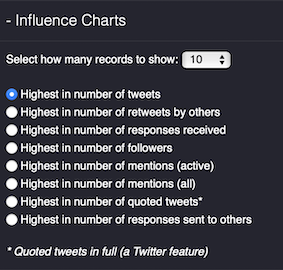
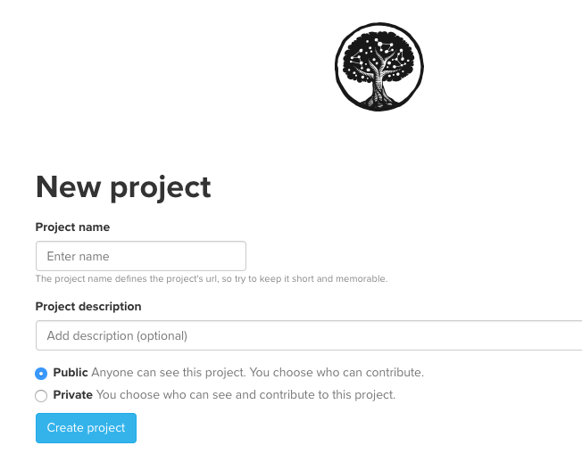

# Mecodify 

## User Manual

Mecodify is an open-source tool to extract, analyse and visualise the usage of twitter for particular queries (e.g., a hashtag, a user account, keywords, etc.) It remains under development and the plan is to add other data sources (e.g., Facebook, YouTube, and other API-enabled websites and services).

#### What is Mecodify for?
Among other uses, Mecodify can be used by researchers to measure the usage of twitter hashtags for example. It can also be used to compare real events with twitter activity. Since Mecodify has a way to connect twitter users with each other using mentions and replies, it can also be used to do some network analysis to identify influential tweeters involved in a particular subject.

#### How did Mecodify start?
Mecodify was created by [Walid Al-Saqaf](http://al-saqaf.se) for the [MeCoDEM EU-FP7 project](http://mecodem.eu) as a tool to allow MeCoDEM researchers to extract, analyse and visualise tweets in relation to particular conflicts in Egypt, Serbia, South Africa and Kenya. Since social science researchers were the main target group, the interface was built in such a way that allows users to utilise its service without having to learn coding or acquire any technical skills. 

**Note:** *Mecodify is at its initial stages and currently only supports Twitter but aims at expanding to support other platforms that have APIs for data extraction.*
___

## Getting started

This section is meant for allowing users to use a fully installed and functional Mecodify instance. For installation instructions, go to http://github.com/wsaqaf/mecodify/installation.md

#### Creating a new account
Only if you are registered as a user can you use Mecodify. To register, simply click on 'Sign up' and enter the requested information as shown. 

Make sure you read *the terms and conditions of use* before accepting since it is important to understand the potential implications from using the software.

Once you create an account, you can then log in and start creating cases or inspect cases that have already been created by other members. 

#### Creating a new case
The most common cases that Mecodify users create are around hashtags. For example, if #FreedomFest16 is the official hashtag for the Freedom Festival 2016 conference, then you can simply create a new case with that as the main query. The case will then include tweets that include that hashtag. 

To create a new case follow the following instructions:
1. Click on "Add a new case". The below form will then appear.

2. Fill in the **ID** field with a unique alphanumeric code of your choice so as to be associated with this case (e.g., westgate2013, ombudsman2015, SanBernardin2015)
3. Fill in the **Name** field with a name of your choice, something readable for you to remember what the case is about (e.g., Tweets on #FreedomFest16 between 1 and 10 Oct 2016)
4. Select the **Platform** to get the data from, as of Nov 2016, this is only confined to Twitter.
5. For Twitter, there are two **search methods** to choose from. 'API Search' gets only results from the last 7 days and is much faster. The other is 'Web Search', which is much slower but can search in the past beyond 7 days. If you choose 'Web Search', you will have the option of deciding the start and end date of the search.
6. For Search criteria, select **'Top results only'** only if you want to get a snapshot or overview of the results based on the specific platform's algorithm. The result will often just be a small sample of the whole dataset. Uncheck if you want to get all the data, which may take longer to fetch and process depending on the amount of the matching results. For cases that are expected to produce fewer than 200,000 results, it is advised to leave this option unchecked.
7. Enter the **case search query**, which is basically the search term (e.g., "#SONA2015 OR #SONA" or "SONA 2015" or "2015 State of the Union Address"). For twitter, check out [those tips](http://lifehacker.com/search-twitter-more-efficiently-with-these-search-opera-1598165519) on using operators for the best results.
8. You can then enter optional **Details** on the case. This is a helpful field to provide a background about this particular case and why you think it is important to study.
9. Enter the optional **URL** value if you wish to add an external reference.
10. You can also enter the **Flags** value, which is a JSON set of flagged times and dates where you want to mark on the timeline. The below example shows how three flags can be added. You can insert as many flags as you want but please follow the given format:
{"flags": [{ 
"date_and_time": "YYYY-MM-DD HH:MM:SS", 
"title": "title1", 
"description": "description1" 
}, 
{ 
"date_and_time": "YYYY-MM-DD HH:MM:SS", 
"title": "title2", 
"description": "description2" 
}, 
{ 
"date_and_time": "YYYY-MM-DD HH:MM:SS", 
"title": "title3", 
"description": "description3" 
}]}
**Note:** Before submitting any flags field, please validate it using a JSON validator such as [JSONlint](http://jsonlint.com).
11. Finally, decide on the **Privacy** settings by selecting whther it will only be you who is able to view the case or if you wish to have other members see it. To have it shared with peers, it is probably better to have it 'public'. But if it is only you who is concerned with it, then keeping it as 'private' may be the better option. Note that no one except you -as the owner- is able to edit or delete the case regardless of this setting.
12. Once you are done filling the form, you should click **Submit case**, then after a few seconds, you will get a screen like this:

13. By clicking on 'Click here', you will then allow Mecodify to start extracting data from the particular platform using the selected method. A new tab will then open showing progress in extracting data as shown below. You have the option of clicking on "Stop" to interrupt the extraction process, which can be resumed later by clicking on "Resume". 

 

The 'Created' field indicates the time and date the case was created. Status can be 'In progress', 'Stopped' (when the process is halted either intentionally or due to some other technical reason), or 'Completed', which means that all relevant data for the case has been successfully fetched. The 'Last process started' is self-explanatory and is useful in case of multiple interruptions to identify when the last time the process was resumed. Last activity refers to the last time there was an update to the database. The Period covered indicates the first and last data entries. For example, for a case that is meant to cover a full week, it is helpful to see how far the process is in terms of days and hours. Records fetched refers to the entries that have been retrieved as mere index (pointer) while the 'Detailed records fetched' refers to the full details that are associated with the pointer. For twitter, records fetched means the tweet id, and the full record refers to the full data associated with that tweet id (e.g., tweet text, tweeter's information, etc.)

#### Getting info about a case
To check progress of any case, all you need to do is to go to the main page and click on the drop down menu under **Cases - Select a case from below** as shown below. 

You can then select the case and click on **More info about the selected case** after which you will get all the information you have entered into the case. Towards the bottom of the table, you will find the **Action** line (as shown below). You can then click on **Edit**, which will take you to a form that allows you to change some of the case's values. You can also click on **more info**, which will open a new tab containing the progress indicator shown earlier.

## Data analysis and visualisation
There are two domains that Mecodify allows to analyse twitter data. The first is for the content, i.e., tweets, and the second is for tweeters, i.e., the users of twitter that posted the tweets. Below each of those domains is presented separately.

### Analysis and visualisation of tweets

To analyse tweets of a particular case, you will need to select the case and then apply any of the available filters (to be described later) if needed. You then can click on the **Visualise** button, which will plot a graph with the default settings showing the total number of tweets and retweets for the period covered by the case as shown below. 

Below the graph, there is a link to the 'interactive slides interface', which -when clicked- opens a new window that includes a graph (on the left) indicating the time and number of retweets as shown below. The tweets are ordered according to the table's sorting (details later).

Furthermore, a hashtag cloud representing the most frequent hashtags will also be displayed below the graph (unless turned off by the user) in addition to a table containing all tweets (ordered by time) will be displayed and paginated per 100 tweets as shown below.

You will notice that above the table, there are links to the most shared/retweeted images, videos and links. Those links help assess which of the tweets gained traction and received the highest number of retweets. When clicking on any of those links, you will get a new table listing the photos, videos or links (based on what you chose) as shown below. 

You can then click on any of the images/video/links to see the tweets that included that particular photo/video/link. This way, not only can you know the most popular photos, videos and links, but you can also how they were used (context, tweeter, etc.) and since they are sorted by time, you can know who was the first during the defined period to have used it as shown below.

For each row in the table, there are the following pieces of information:
- Date and time (in GMT) the tweet was posted
- The tweeter's profile image and other information (followers, following, creation date, total tweets, geographical location and timezone)
- The actual tweet text
- The number of retweets
- Number of favorites
- Interaction (if any): This refers to the responses the tweet received. By clicking on the link, it is possible to see recursive interactions (original tweet, response to tweet, responses to the response, etc.) as shown below:

- Source: this refers to the application that was used to post on twitter (e.g., Twitter Web Client, Twitter for iPhone, Twitter for Android, TweetDeck, etc.)
- Language: this is the two-letter language value that Twitter returns based on its own language-detection algorithm (can sometimes be incaccurate)
- Verified user: This indicates whether the tweeter has been [verified by twitter](https://support.twitter.com/articles/119135)
- Image (if any): This includes the image or set of images that the tweet includes 

It is possible to sort the table based on any of the column values. To identify the top tweets in terms of retweets, clicking on the **retweets** column sorts them from highest to lowest. One can also sort them based on the level of interactivity. etc.

Exporting the table into a CSV file is also possible by clicking on the 'Export all X records to CSV file' (where X is the total number of tweets fetched), which appears just above the top right corner of the table. The data can then be imported to other software such as MS Excel or [Tableau](http://tableau.com) for further processing. 

#### Filtering of tweets

Mecodify provides a host of filters and parameters that give you more control over how you analyse and visualise twitter data. Each of those filters are described below.

##### Tweet Type
You can choose what types of tweets you wish to show on the graph and table by clicking on 'Specific types' and then check the corresponding checkbox or/and enter text in any of the fields. The filters, which are off by default, are as follows:

- **Include an image**: Only show tweets that have an image
- **Include a video**: Only show tweets that have a video (embedded from YouTube or other platforms)
- **Include a link**: Only show tweets that have a link
- **From a verified user**: Only show tweets that are posted from an account whose holder is verified by twitter
- **Is a retweet**: Only show retweets of tweets (no original tweets are shown). *Note: This option would only work for cases retrieved via the API Search method*
- **Is a response**: Only show retweets thar constitute a reply to another tweet or tweeter
- **Has a response**: Only show tweets that received responses from others
- **Qoutes another tweet**: Only show tweets that are quoted by others
- **Has mentions**: Only show tweets that include mentions (screen names that start with @)
- **Has any of those hashtags**: Only show tweets that have any of the provided hashtags (multiple hashtags need to have a space between them) [case insensitive]
- **Has any of those keywords**: Only show tweets that have any of the provided keywords (multiple keywords need to have a space between them) [case insensitive]
- **Has all of those keywords**: Only show tweets that have all of the provided keywords (multiple keywords need to have a space between them) [case insensitive]
- **Has this exact phrase**: Only show tweets that have the exact phrase [case insensitive]
-Sent from those users**: Only show tweets that are posted by the users whose screen names are provided
- **In reply to this tweet id**: If the tweet id of a particular tweet is known (The tweet id can be fould on the url after you click on the tweet. e.g., https://twitter.com/RealHughJackman/status/**759043035355312128**), it is possible to list all the tweets within the dataset that are replies to that tweet
- **Any of those locations (if known)**: Only show tweets that are posted by individuals whose geographical location provided in the profile or within the tweet itself matches the one provided
- **Was retweeted at least this many times**: This is a very useful parameter that allow you to only show tweets that have achieved  a particular threshold of publicitly, e.g., were tweeted X times

*Note that the filters applies the 'AND' operator by default. This means that if you select multiple filters, tweets that meet all the filter conditions will be shown.*

##### Graph metrics
Graph metrics allows changing the measurement metrics for the 'Y' axis against the timeline for the graph. It has three options:

- **Add retweets to the count (default):** This means that the 'Y' axis on the graph represents both the number of tweets posted in addition to the number of retweets they got.
- **Count only original tweets:** This would allow the plotting of original tweets and disregard retweets. For example, if there are ten tweets posted, one per hour, and the graph covers the eight hours, the graph will be a straight line. But if each of the tweets had a different number of retweets, then the graph will reflect each of those values.
- **Count only unique tweeters:** This would only plot the number of tweeters that have been tweeting for the given time. For example, if the same tweeter has been tweeting multiple times in the same period, all his/her tweets will be presented as just one unit. This is helpful to analyse the level of diversity of tweeters instead of tweets.

#### Period
This setting is useful in covering only a particular period of time and in displaying the graph based on other units than the default (hour) unit.

- **Cover the whole period:** This is the default and allows covering the whole period
- **Cover a specific period only:** Here you can define the start and end of the period you wish to have plotted and displayed in the table. Note that Mecodify autoatically figures out the minimum and maximum values that you could use by providing a note saying: *"Valid period ranges for <CASE ID>: From:YYYY-MM-DD To:YYYY-MM-DD*. This helps avoid entering invalid dates.
- **Start Date: dd/mm/yyyy** This is the date you wish to start with. If it is blank, Mecodify will assume that you wish to start from beginning.
- **Start Time: hh:mm** This is the time on the date provided at which you wish to start with. If it is blank, Mecodify will assume that you wish to start from 00:00.
- **End Date: dd/mm/yyyy** This is the date you wish to end with. If it is blank, Mecodify will assume that you wish to end with at the maximum limit.
- **End Time: hh:mm** This is the time on the date provided at which you wish to end with. If it is blank, Mecodify will assume that you wish to end at 23:59.
- **Graph timeseries unit:** While the default unit of the graph's timeline (x axis) is hours, you can change it to days, or go lower to hours, minutes and even seconds. Selecting 'seconds' will probably take longer to plot but will provide the ability to zoom into the most detailed segments of the graph to see how tweets developed over short periods of times. This is helpful, for example, to investigate who was the first to start a particular hashtag and how it developed over a short period of time.

#### Language
Twitter has its own algorithm to automatically detect the language used in a particular tweet. This value is fetched through the API and can be used to filter tweets accordingly on Mecodify. To filter by language, you have three options:

- **Tweets in all languages:** This is the default settings and means there is no filter
- **Tweets in English only:** This would show the tweets that are in English only
- **Tweets in specific languages:** Here you can enter the languages you wish to display (separated by commas). There is no limit to which languages you want to have but each language must be in entered based on the 2-letter universal codes, which you can find [here](http://www.andiamo.co.uk/resources/iso-language-codes).

#### Source
Mecodify also extracts from twitter a variable corresponding to the application the tweeter used to post a particular tweet. Those names are provided by the API and help identify what platform and operating was used. The options are:

- **All:** This is the default value and it means that all sources are included
- **Web:** This filter tries to guess to the best of its ability whether the default browser was used on a desktop/laptop computer with a Windows, Mac or Linux operating system (not a hand-held device). It is not guaranteed to be accurate though
- **Mobile:** This filter detects whether words corresponding to mobile devices was used, such as Android, iPhone, iPad, BlackBerry, etc. Again, it is just a rough measurement that could occasionally fail
- **Specific sources:** This filter is perhaps the most reliable since it allows you to identify exactly which of the applications was used for posting. As shown above, some of the most common applications are provided, but there is also the opportunity to add other sources in the provided field (as comma-separated values)

#### Other visualisation options
While displaying the hashtag cloud above the table is set by default, you can opt to turn it off by unchecking the corresponding checkbox next to the 'Visualise' button.

One of the most powerful features of Mecodify is the **'overlay on current graph'** checkbox (off by default), which when switched on, allows you to plot graphs on top of each other seamlessly. The new graph will have a different color than the current graph to allow easy tracking of activity (as shown in the graph below). Furthermore, it is possible to hide and display any of the graphs by simply clicking on the name (on the legend) corresponding to the particular graph. It is in fact possible to combined graphs from different cases with the overlay.

___
### Analysis and visualisation of tweeters
So far, you have learned how to analyse and plot graphs of tweets. Here, you will learn how to plot graphs on tweeters, i.e., the users who tweeted those tweets.

#### Influence charts
One of the most interesting research questions that one could ask is who are the tweeters that are most active/influential in a particular case. Mecodify helps answer that question by listing the top 5,10,25,50,100 and 200 most influential tweeters based on the following metrics:

- **Highest in number of tweets:** Know who has been most actively tweeting
- **Highest in number of retweets by others:** Know the tweeters whose tweets got retweeted the most (in total).
- **Highest in number of responses received:** Know the tweeters whose received the highest number of responses to their tweets (in total).
- **Highest in number of followers:** Know those who were involved in the case and had the highest number of followers.
- **Highest in number of mentions (active):** Know the account holders who have mentioned the most but who have also tweeted something.
- **Highest in number of mentions (all):** Know the accounts of tweeters who were mentioned the most but who have not necessarily tweeted anything in the case. *This is useful in cases where one wants to measure the strong appeal to certain accounts to respond*
- **Highest in number of quoted tweets:** Know the tweeters who were quoted most frequently (using twitter's built-in feature in quoting full tweets). 
- **Highest in number of responses sent to others:** Know the tweeters who tend to respond most frequently to others.

Once you decide which of the above factor you want to apply, you will get a horizontal bar chart along ordered from highest to lowest (as shown). By clicking on any of the bars, you'll get a box on top of the chart with more information about that individual tweeters. Additionally, you'll notice a link saying "Export to CSV file (full list of X tweeters)", which allows you to download the full list of tweeters sorted based on the particular metric you chose. The list can then be used for further processing using other software such as Tableau and MS Excel.

Below the chart, you will see the list of tweeters with their ranking along with their profile information. Additionally, you will notice a separate small table entitled "In connection to <CASE id>" having couple of lines reflecting the number of tweets within the case and number of retweets by others. Below that, the *'See the tweets'* link takes you to the Tweets tab where you can view a graph with only the tweets that were posted by that particular account. 

#### Other options
Additionally, you can also filter tweeters based on three additional variables to refine the search even further. Those are:

- **Limit to tweeters in location(s):** You can use this to only list the tweeters based on what they have as the location on their profile (e.g., New York, UK, etc.). This is not always accurate since it depends on whether the person has entered that optional information accurately into their profile.

- **Limit to tweeters using lanuages(s):** Similarly, this filter can help you narrow down the list to those who have set their profile language to specific languages. It uses the 2-letter formal codes (see the list [here](http://www.andiamo.co.uk/resources/iso-language-codes)).

- **Bio containing any of those words:** Occasionally, you may want to only list those who have a particular interest or affiliation. For example, you could use the words "media, journalism, journalist, blogger, broadcasting" to identify those who are related to media or journalism.

#### Network visualisation
While having the list of tweeters helps you identify who is influential in pure quantitative terms, network visualisation allows you to identify connections and relationships between differnet tweeters. Mecodify has a way to identify network relationships in a particular case in two ways:

- **By replies:** This corresponds to the relationship between tweeters in terms of having a tweeter replying to the other directly through the twitter platform. This information is obtained via a twitter API and a reply does not necessarily require having a mention of the original tweeter. 
- **By mentions:** This corresponds to the relationship between tweeters purely in terms of who mentions who. It does not necessarily entail a particular reply but just the pure mention of one or more tweeter constitutes a relationship.
*Note:* The network connection strength level refers to the number of times in total each of the tweeters responded to or mentioned the other. If you have 1 as the level, then all tweeters who mentioned or replied to another at least once will be displayed. But if you have 5, only those who have mentioned or responded to a particular tweeter at least 5 times will be displayed, which means that only the strongest bonds are shown.
An example network would look something like this:

The graph is actually interactive so you can click on any of the nodes to have it zoom and color the edges so that red means that the link is inward (a response/mention of that particular node) and a blue is outgoing (the node is responding/mentioning the node it connects to). 
For example, when you click on the tweeter @rsapolitics, you will notice that two edges to @presidencyza and @sabreakingnews turned blue, which means that @rsapolitics has responded to each of the other tweeters. Simultaneously, one edge turns red indicating that @teamcopesa has in fact responded to @rsapolitics as shown below.

Furthermore, when you double click on any of the nodes, Mecodify takes you to the tweets tab showing you the tweets that particular tweeter has produced.

#### Exporting to Kumu
Mecodify also allows you to integrate data with [Kumu](https://kumu.io), which is a powerful and specialised data visualisation platform that helps organise complex information into interactive relationship maps.

To make the best use of Kumu, you can download the **Tweeter CSV file for Kumu import**, which contains all tweeters (nodes) who have tweeted in the case. And depending on what you want to analyse, you can download one of the following files:
* **Response CSV file for Kumu import:** This CSV file contains the response relationships (edges) between the various tweeters.
* **Mentions CSV file for Kumu import:** This CSV file contains the mention relationships (edges) between the various tweeters.

In order to best utilise Kumu for the analysis, you can follow the following steps:
1- Go to [Kumu's website](https://kumu.io) and log into your dashboard. You can create an account free of charge if you have not yet done so. Note however that the free service requires placing any data you upload and maps you create in the public domain.

2- Create a new project and give it any name you like.

3- Select *Stakeholder* map since it is the most suitable for this type of analysis.

4- Enter a map the corresponds to whether you wish to have it for responses or mentions (to make it easier to identify).

5- Once you are in, click on the green button with the plus sign and then click on **Import** to start importing your data

6- Select the CSV tab and click on the **Select .csv file**, then select the elements file (the one that ends with _users.csv)

7- Once you import the file successfully click **'Save import'** and you will  notice the tweeter nodes appearing.

8- Repeat the same steps (5-7) above but this time, select the mentions or response file (the one ending with _responses.csv or _mentions.csv depending on what you which map you wish to plot.

9- Once done, you will see the network coming nicely together as shown.

10- You can now start using the various social network analysis functions that Kumu provides such as finding the most influential actors (using the eigenvector analysis) and bottlenecks (in-betweenness analysis). You can benefit from Kumu's [tutorials and documentations](https://docs.kumu.io/) to make the best out of the platform.

___

#### Questions or comments?

If you have any questions or concerns, feel free to contact the Mecodify team on [admin@mecodify.org](mailto:admin@mecodify.org) and we will be glad to come back to you.

